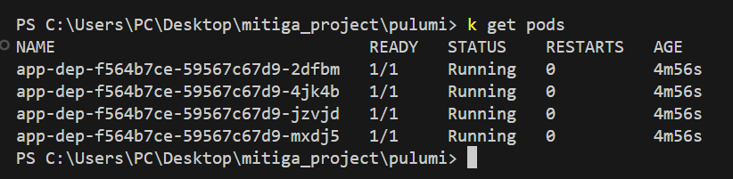
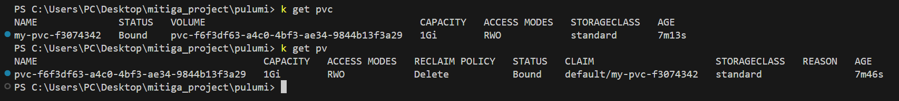
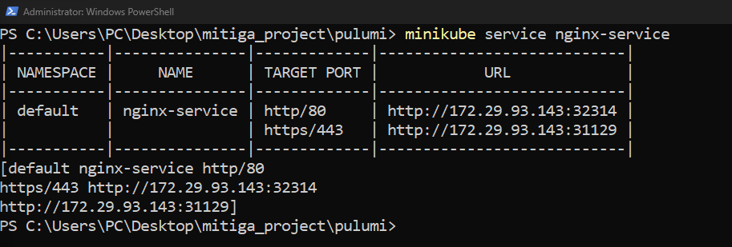
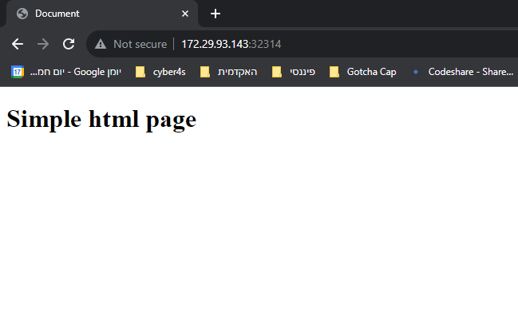
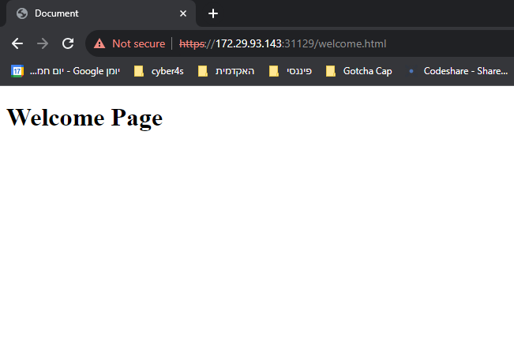

# Mitiga Home Project

This is a small project that serves 2 html pages locally.
Technologies: Kubernetes, Docker, Pulumi, Nginx

### Getting Started

1. Install minikube and run 
```bash
minikube start
```
2. Cd into the project and build the image
```bash
 docker build -t mynginx .
```
3. Push mynginx into minikube docker registry using this tutorial: https://minikube.sigs.k8s.io/docs/handbook/registry/
4. Cd inside pulumi directory and run
```bash
 pulumi up
```
5. Test HTTP and HTTPS 
```bash
minikube service nginx-service
```
6. run the URL's provided 










