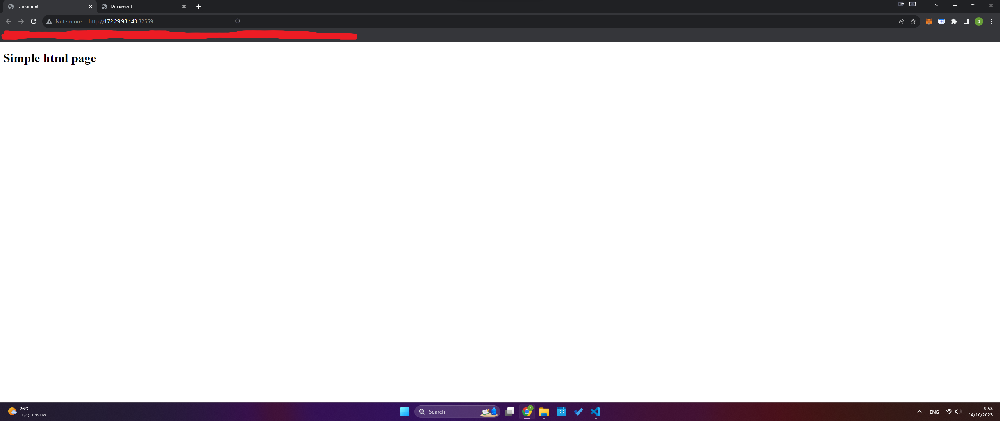

# Mitiga Home Project

This is a small project that serves 2 html pages both locally and on remotely.
Technologies: Kubernetes, Docker, Pulumi, Nginx, Google Cloud SDK


### GKE - BONUS
Using GKE and basic yaml files: https://35.193.213.0/index.html , https://35.193.213.0/welcome.html

### Minikube - 

1. Clone the repo<br>
`git clone https://github.com/benhanover/mitiga_project.git`<br>
`cd ./mitiga_project`

2. Create Self Signed SSL<br>
`cd ./resources`<br>
`mkdir certs`<br>
`cd certs`<br>
`openssl req -x509 -nodes -days 365 -newkey rsa:2048 -keyout ./nginx-selfsigned.key -out ./nginx-selfsigned.crt`

3. Build the image<br>
`cd ../../`<br>
`docker build -t mynginx ./`<br>

4. Start minikube<br>
`minikube start`<br>

5. Push mynginx into minikube docker registry using this tutorial: 
https://minikube.sigs.k8s.io/docs/handbook/registry/

6. Run pulumi<br>
`cd ./pulumi_minikube`<br>
`pulumi up`<br>
output: <br>
```bash
PS C:\Users\PC\projects\mitiga_project\pulumi_minikube> pulumi up
Please choose a stack, or create a new one:  [Use arrows to move, type to filter]
  dev
Please choose a stack, or create a new one: dev
Previewing update (dev)

View in Browser (Ctrl+O): https://app.pulumi.com/benhanover/mitiga/dev/previews/95abb753-01a2-4a66-8579-815391839e2e

     Type                                         Name           Plan
 +   pulumi:pulumi:Stack                          mitiga-dev     create
 +   ├─ kubernetes:core/v1:Service                nginx-service  create
 +   ├─ kubernetes:core/v1:PersistentVolumeClaim  my-pvc         create
 +   └─ kubernetes:apps/v1:Deployment             app-dep        create
Outputs:
    deployment_name: "app-dep-3c4835ac"
    service_name   : "nginx-service"

Resources:
    + 4 to create

Do you want to perform this update? yes
Updating (dev)

View in Browser (Ctrl+O): https://app.pulumi.com/benhanover/mitiga/dev/updates/61

     Type                                         Name           Status
 +   pulumi:pulumi:Stack                          mitiga-dev     created (12s)
 +   ├─ kubernetes:core/v1:PersistentVolumeClaim  my-pvc         created (0.96s)
 +   ├─ kubernetes:core/v1:Service                nginx-service  created (10s)
 +   └─ kubernetes:apps/v1:Deployment             app-dep        created (2s)
Outputs:
```
```bash
PS C:\Users\PC\projects\mitiga_project\pulumi_minikube> kgp
NAME                                READY   STATUS    RESTARTS   AGE
app-dep-2126595f-794f88db4f-2hgx6   1/1     Running   0          37m
app-dep-2126595f-794f88db4f-r6qqd   1/1     Running   0          37m
app-dep-2126595f-794f88db4f-x9mz7   1/1     Running   0          37m
app-dep-2126595f-794f88db4f-xzb4x   1/1     Running   0          37m
```


7. Find HTTP and HTTPS IP adresses<br>
`minikube service nginx-service`<br>
you should see something like this: <br>
```bash
PS C:\Users\PC\projects> minikube service nginx-service
|-----------|---------------|-------------|----------------------------|
| NAMESPACE |     NAME      | TARGET PORT |            URL             |
|-----------|---------------|-------------|----------------------------|
| default   | nginx-service | http/80     | http://172.29.93.143:32559 |
|           |               | https/443   | http://172.29.93.143:32326 |
|-----------|---------------|-------------|----------------------------|
[default nginx-service http/80
https/443 http://172.29.93.143:32559
http://172.29.93.143:32326]
```
for this example you can open your browser and check the following address:<br>
HTTP -
- http://172.29.93.143:32559
- http://172.29.93.143:32559/welcome.html <br>

HTTPS - 
- https://172.29.93.143:32326 
- https://172.29.93.143:32326/welcome.html





